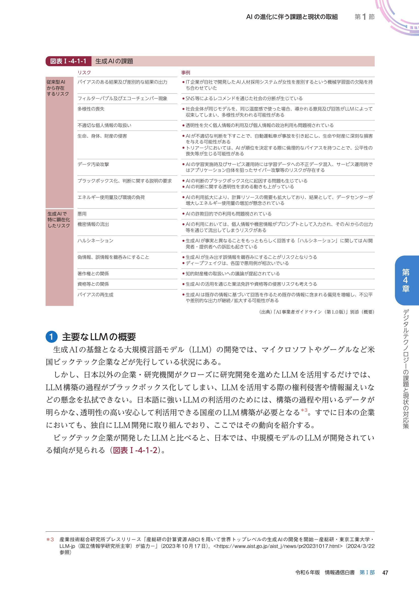
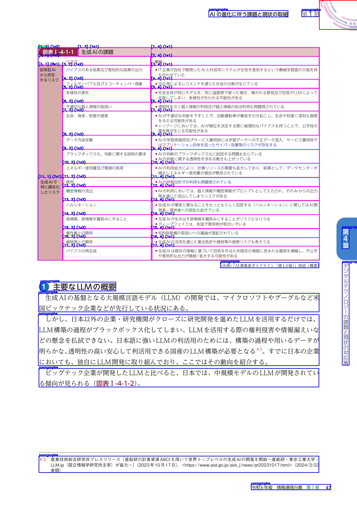
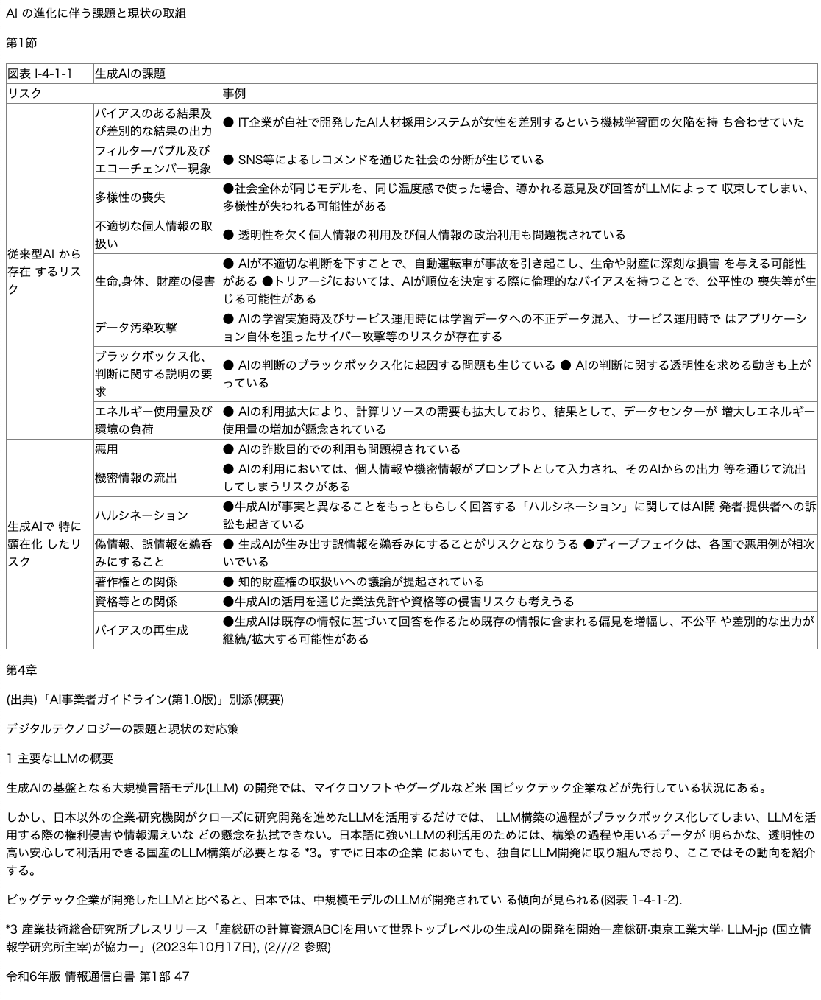

# YomiToku


[](https://kotaro-kinoshita.github.io/yomitoku-dev/)

## 🌟 概要

YomiToku は日本語の文書画像解析に特化した AI ベースの文章画像解析エンジンです。画像内の文字の全文 OCR およびレイアウト解析機能を有しており、画像内の文字情報や図表を抽出、認識します。

- 🤖 日本語データセットで学習した 4 種類(文字位置の検知、文字列認識、レイアウト解析、表の構造認識)の AI モデルを搭載しています。4 種類のモデルはすべて独自に学習されたモデルです。
- 🇯🇵 各モデルは日本語の文書画像に特化して学習されており、7000 文字を超える日本語文字の認識をサーポート、縦書きなど日本語特有のレイアウト構造の文書画像の解析も可能です
- 📈 レイアウト解析、表の構造解析機能により、文書画像のレイアウト構造を可能な限り維持した状態で、情報を抽出することが可能です。
- 📄 多様な出力形式をサポートし、html やマークダウン、json、csv のいずれかのフォーマットに変換し、出力可能です。

## 🖼️ デモ

[gallery.md](gallery.md)にも複数種類の画像の検証結果を掲載しています。

|                     入力画像                     |                      OCR                       |
| :----------------------------------------------: | :--------------------------------------------: |
|         |   |
|                  レイアウト解析                  |                  エクスポート                  |
|  |  |

Markdown でエクスポートした結果は関してはリポジトリ内の[demo.md](demo.md)を参照

画像の出典:[「令和 6 年版情報通信白書 3 章 2 節 AI の進化に伴い発展するテクノロジー」](https://www.soumu.go.jp/johotsusintokei/whitepaper/ja/r06/pdf/n1410000.pdf)：（総務省） を加工して作成

## 📣 リリース情報

- 2024 年 12 月 XX vX.X.X をリリース

## 💡 インストールの方法

```
pip install --index-url https://test.pypi.org/simple/ yomitoku
```

### 依存ライブラリ

pdf ファイルの解析を行うためには、別途、[poppler](https://poppler.freedesktop.org/)のインストールが必要です。

**Mac**

```
brew install poppler
```

**Linux**

```
apt install poppler-utils -y
```

## 🚀 実行方法

```
yomitoku ${path_data} -f md -o results -v
```

- `${path_data}` 解析対象の画像が含まれたディレクトリか画像ファイルのパスを直接して指定してください。ディレクトリを対象とした場合はディレクトリのサブディレクトリ内の画像も含めて処理を実行します。
- `-f` 出力形式のファイルフォーマットを指定します。(json, csv, html, md をサポート)
- `-o` 出力先のディレクトリ名を指定します。存在しない場合は新規で作成されます。
- `-v` を指定すると解析結果を可視化した画像を出力します。
- `-d` モデルを実行するためのデバイスを指定します。gpu が利用できない場合は cpu で推論が実行されます。(デフォルト: cuda)

### Note

- CPU を用いての推論向けに最適化されておらず、処理時間が長くなりますので、GPU での実行を推奨します。
- 活字のみ識別をサポートしております。手書き文字に関しては、読み取れる場合もありますが、公式にはサポートしておりません。
- OCR は文書 OCR と情景 OCR(看板など紙以外にプリントされた文字)に大別されますが、Yomitoku は文書 OCR 向けに最適化されています。
- AI-OCR の識別精度を高めるために、入力画像の解像度が重要です。低解像度画像では識別精度が低下します。画像の短辺を 1000px 以上の画像で推論することをお勧めします。

## 📝 ドキュメント

パッケージの詳細は[ドキュメント](https://kotaro-kinoshita.github.io/yomitoku-dev/)を確認してください。

## 🔥 開発予定

YomiToku は現在も開発中であり、今後以下のような機能の拡張を目指しています。

- 文章の読み順推定機能

  段組など複雑なレイアウトが与えられた場合にエクスポート時に読み取り順序が意図しない結果となる課題があります。段落ごとの読み順を推定し、文書が自然な並びで再構成できるように読み順推定モデルを構築する予定です。

## LICENSE

YomiToku © 2024 by MLism inc. is licensed under CC BY-NC 4.0. To view a copy of this license, visit https://creativecommons.org/licenses/by-nc/4.0/

## 🙏 謝辞

YomiToku 内に搭載されているモデルは以下のオープンソース AI を参考し、開発しています。開発者の皆様に感謝申し上げます

- [DBNet](https://github.com/MhLiao/DB)
- [PARSeq](https://github.com/baudm/parseq)
- [RTDETR](https://github.com/lyuwenyu/RT-DETR)
