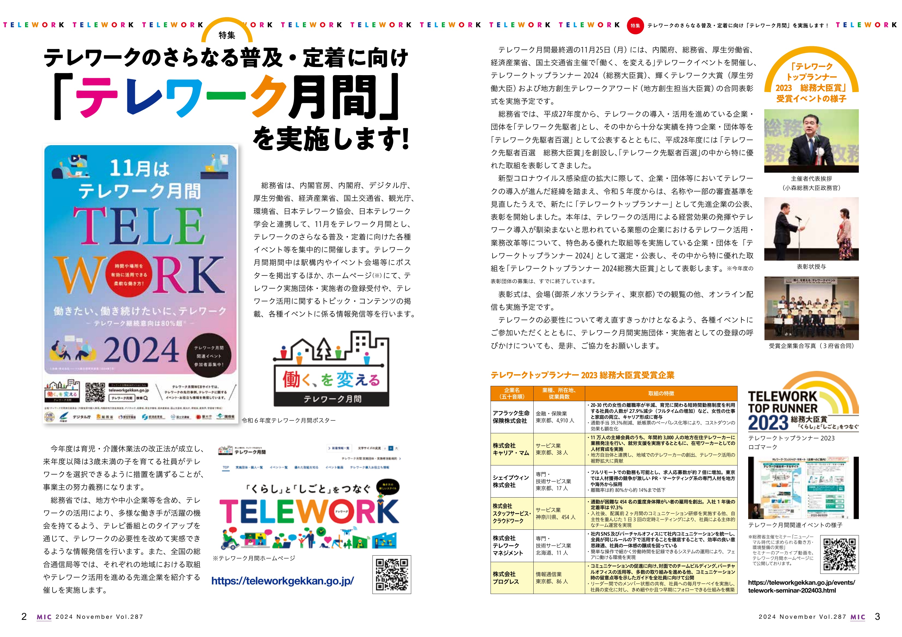
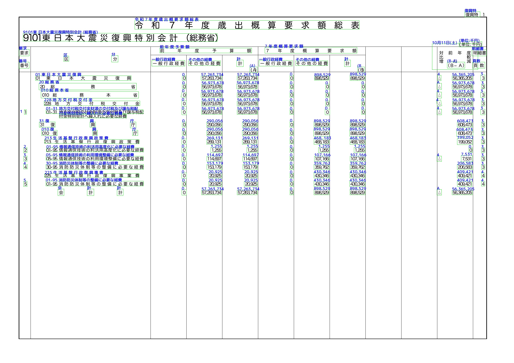
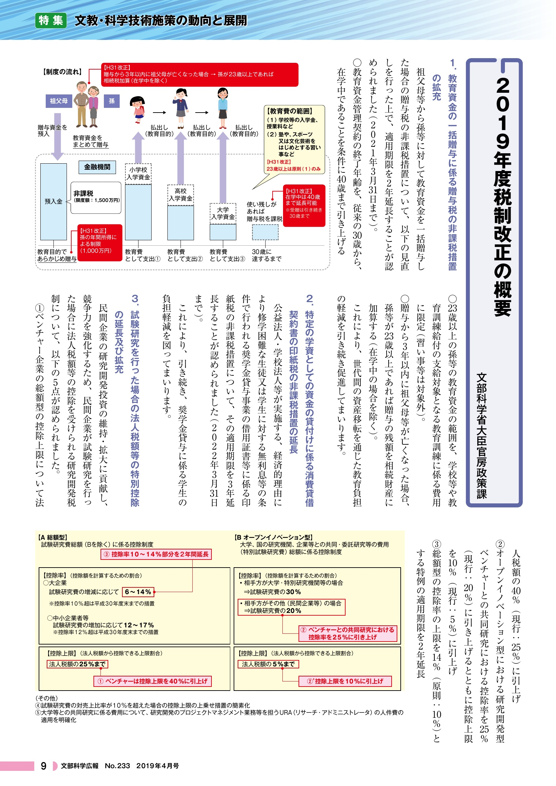
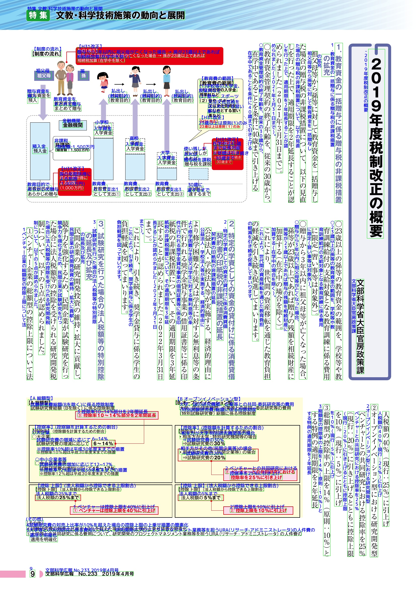
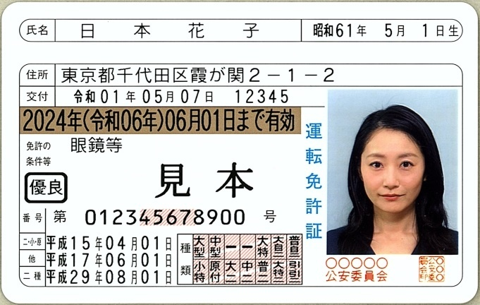
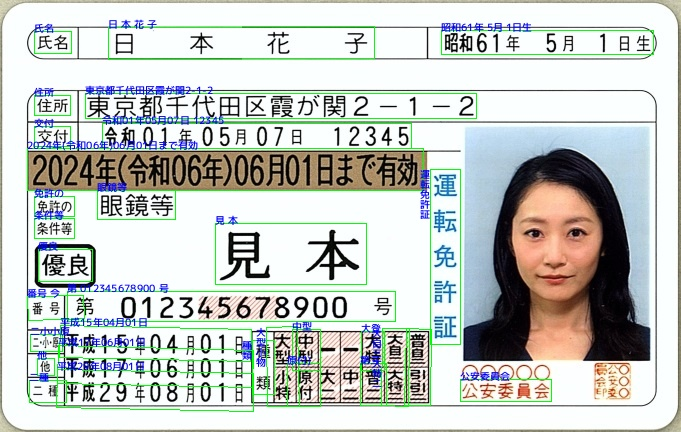
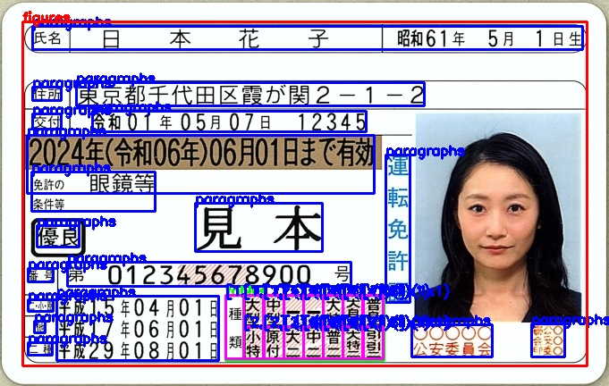

|                     入力画像                     |                         OCR                          |                     レイアウト解析                      |            markdown            |
| :----------------------------------------------: | :--------------------------------------------------: | :-----------------------------------------------------: | :----------------------------: |
|  ※1 |  ※1 |  ※1 | [results1](static/gallery1.md) |
|  ※2 |  ※2 |  ※2 | [results2](static/gallery2.md) |
|  ※3 |  ※3 |  ※3 | [results3](static/gallery3.md) |
|  ※4 |  ※4 |  ※4 | [results4](static/gallery5.md) |
|     |     |     | [results5](static/gallery4.md) |
|     |     |     | [results6](static/gallery6.md) |

- ※1 出典:[「広報誌 令和 6 年 11 月号」](https://www.soumu.go.jp/menu_news/kouhoushi/koho/2411.html)：（総務省） を加工して作成
- ※2 出典:[「令和 7 年度歳出予算概算要求書（東日本大震災復興特別会計）」](https://www.soumu.go.jp/main_content/000967305.pdf)：（総務省） を加工して作成
- ※3 出典: [「文部科学広報　 2019 年 4 月号」](https://www.mext.go.jp/b_menu/kouhou/08121808/001/1416239.htm)：（文部科学省） を加工して作成
- ※4 出典: [「運転免許の更新等運転免許に関する諸手続について」](https://www.npa.go.jp/policies/application/license_renewal/index.html)：(警察庁)を加工して作成
